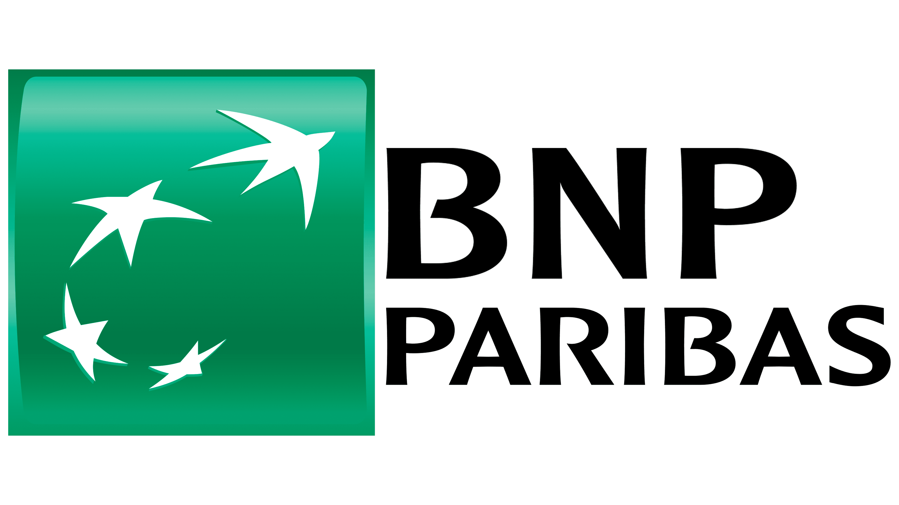
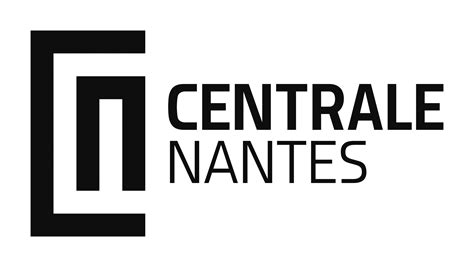

# BNP Paribas — Savings Agent Dashboard

Interface IA pour conseillers bancaires BNP Paribas. Permet d'interroger les données clients en langage naturel et d'obtenir des insights actionnables avant une réunion.





## Prérequis

- Python 3.11+
- Node.js 18+
- Une clé API OpenAI (GPT-4o)

## Démarrage rapide

### 1. Configurer la clé OpenAI

```bash
# Modifier le fichier backend/.env
OPENAI_API_KEY=sk-votre-cle-ici
```

### 2. Démarrer le backend

```bash
cd backend
pip install -r requirements.txt
uvicorn main:app --reload --port 8000
```

Le backend sera accessible sur http://localhost:8000
Documentation API : http://localhost:8000/docs

### 3. Démarrer le frontend

```bash
cd frontend
npm install
npm run dev
```

L'application sera accessible sur http://localhost:5173

## Architecture

```
backend/
  main.py          — API FastAPI (endpoints /clients, /chat, /meeting-brief)
  agent.py         — Agent GPT-4o avec tool calling
  tools.py         — 8 outils de requête pandas
  data_loader.py   — Chargement Excel → DataFrames

frontend/src/
  App.tsx                        — Point d'entrée
  api.ts                         — Appels API
  components/
    ClientSelector.tsx           — Sélecteur de client
    ChatInterface.tsx            — Interface de chat
    ChartRenderer.tsx            — Graphiques (line/pie/bar)
    MeetingBrief.tsx             — Fiche de préparation de réunion

data/
  banking_customers.xlsx         — Données clients (11 feuilles, 10 clients)
```

## Fonctionnalités

- **Chat en langage naturel** : posez des questions sur n'importe quel client
- **Graphiques automatiques** : l'IA génère des visualisations quand c'est pertinent
- **Fiche de préparation** : brief complet pour préparer une réunion client
- **Données croisées** : l'IA combine profil, contrats, flux, événements de vie

## Exemples de questions

- "Mon client a-t-il gagné de l'argent l'année dernière ?"
- "Quelle est la santé financière de ce client ?"
- "Quels sont les points clés à aborder en réunion ?"
- "La situation du client a-t-elle changé récemment ?"
- "Quel produit pourrait être pertinent à proposer ?"


